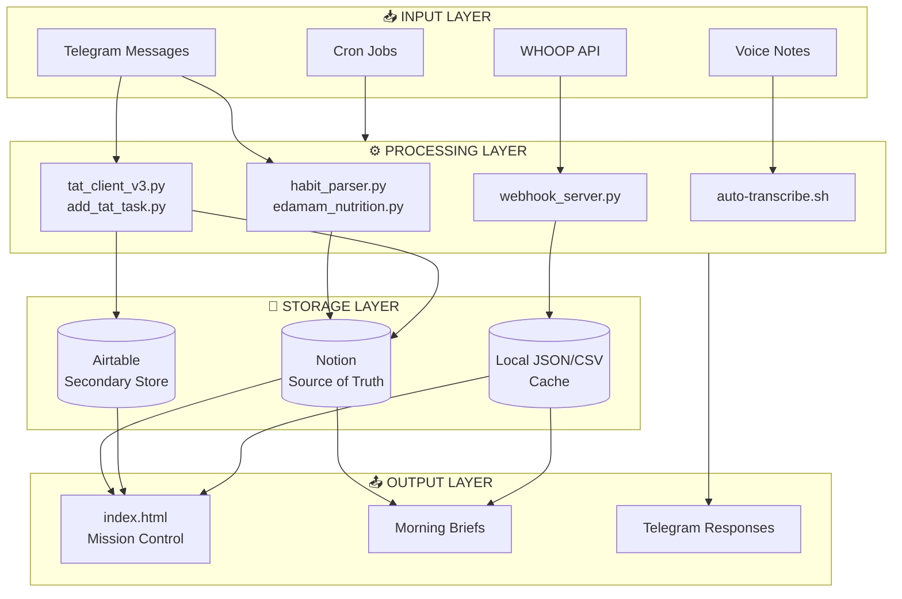
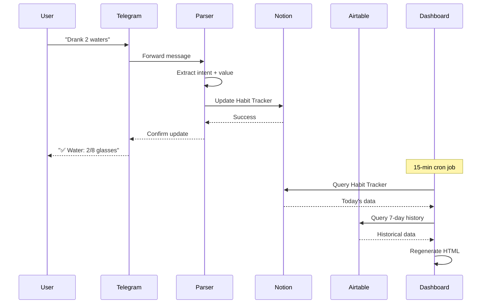
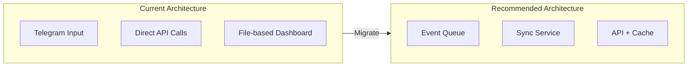

# System Architecture Review - OpenClaw Setup
**Date:** February 14, 2026  
**Reviewer:** System Architect (AI Agent)  
**Scope:** Comprehensive audit of Sam's OpenClaw ecosystem

---

## Executive Summary

Sam's OpenClaw setup is a sophisticated personal productivity and health tracking system with **strong foundational architecture** but **critical gaps in data synchronization** between Notion (primary source of truth), Airtable (secondary storage), and the dashboard (display layer). The system demonstrates good separation of concerns and modular design, but suffers from **stale data**, **dual database complexity** (Notion + Airtable), and **incomplete integrations**.

### Key Findings
- ⚠️ **CRITICAL:** Dual database architecture (Notion + Airtable) creates sync complexity and data inconsistency
- ⚠️ **HIGH:** Some dashboard data sources use outdated Notion API versions (2022-06-28 vs 2025-09-03)
- ⚠️ **MEDIUM:** WHOOP webhook exists but not fully integrated into all dashboard views
- ✅ **GOOD:** Solid cron job infrastructure for scheduled tasks
- ✅ **GOOD:** Natural language parsing for habit/food/TAT updates working well
- ✅ **GOOD:** Mission Control dashboard shows active development with multiple specialized views

---

## 1. NOTION SYNC AUDIT

### Current State

The dashboard (`/dashboard/index.html`) is generated by `generate_dashboard_v2.py`. Analysis reveals a **mixed state**:

| Component | Source | Status | Issue |
|-----------|--------|--------|-------|
| TAT Tasks | Notion API (v2) | ⚠️ PARTIAL | Uses outdated API version, some DB ID mismatches |
| Nutrition | Notion API (v3) | ✅ WORKING | Queries Food Log data source correctly |
| Water | Local JSON file | ⚠️ STALE | Reads from `water_tracker.json` (last updated Feb 13) |
| WHOOP | Multiple sources | ⚠️ PARTIAL | Tries 4 fallback sources but may show stale data |
| Habits | Notion API (v2) | ⚠️ PARTIAL | Uses old API version, incomplete streak data |
| Workout | Hardcoded | ❌ PLACEHOLDER | Static string values |
| Security | File parsing | ⚠️ PARTIAL | Parses markdown but may miss latest updates |

### Notion Databases (Confirmed Existence)

```
📊 Master Cron Schedule          → 2fdf2cb1-2276-81a5-84e9-d60295943cd6
🔨 Overnight Build Tasks          → 2fdf2cb1-2276-81cc-99c6-df60e7a1600e
🔍 Overnight Research Tasks       → 2fdf2cb1-2276-816f-bb5c-d9a812891de3
🏋️ Habit Tracker                 → 2fdf2cb1-2276-819a-b352-000b8c4ff0be
📋 TAT Task System               → 2fcf2cb1-2276-81d6-aebe-f388bdb09b8e (updated ID)
🍎 Food Log (Nutrition)          → c1d1100c-cbc4-416d-8c1b-59f7e2ff15c0 (data source ID)
```

### Root Cause Analysis

**The Problem:** The `generate_dashboard_v2.py` has inconsistent API usage:

1. **Mixed API Versions:** Some queries use `2022-06-28`, others use `2025-09-03`
2. **Database ID Drift:** TAT database ID in code may not match actual Notion database
3. **Missing Streak Data:** Habit streaks require additional calculations not implemented
4. **Dual Database Confusion:** Some scripts fetch from Airtable, others from Notion

**Key Code Issues Found:**

```python
# In generate_dashboard_v2.py - INCONSISTENT API VERSIONS

# Line ~49: Uses OLD API version for TAT
headers = {
    "Authorization": f"Bearer {notion_key}",
    "Notion-Version": "2022-06-28",  # ← OUTDATED
    "Content-Type": "application/json"
}

# Line ~236: Uses NEW API version for Nutrition
headers = {
    "Authorization": f"Bearer {notion_key}",
    "Notion-Version": "2025-09-03",  # ← CORRECT
    "Content-Type": "application/json"
}

# Line ~389: Uses OLD API version for Habits
headers = {
    "Authorization": f"Bearer {notion_key}",
    "Notion-Version": "2022-06-28",  # ← OUTDATED
    "Content-Type": "application/json"
}
```

### Airtable vs Notion Data Duplication

The system has **parallel data storage** creating confusion:

| Data Type | Notion | Airtable | Primary? |
|-----------|--------|----------|----------|
| Habits | ✅ | ✅ | Notion (for daily tracking) |
| Food Log | ✅ | ✅ | Notion (for detailed logging) |
| TAT Tasks | ✅ | ✅ | Airtable (for v3 client) |
| WHOOP | Local CSV | ✅ | Airtable (for 7-day history) |
| Weight | ✅ | ✅ | Unknown |

**Impact:** Data inconsistencies possible when sources get out of sync

---

## 2. DATA FLOW ANALYSIS

### Complete Data Flow Map



### Detailed Flow Analysis

#### FLOW 1: Habit Logging ✅ WORKING
```
Telegram → habit_parser.py → notion_habit_updater.py → Notion Habit Tracker
```

#### FLOW 2: Food/Nutrition ✅ WORKING
```
Telegram → edamam_nutrition.py → notion_nutrition_sync.py → Notion Food Log
```

#### FLOW 3: TAT Updates ⚠️ DUAL PATH
```
Telegram → add_tat_task.py → Notion TAT DB
Telegram → tat_client_v3.py → Airtable TAT DB
```
**Issue:** Tasks may exist in one system but not the other

#### FLOW 4: WHOOP Data ⚠️ PARTIAL
```
WHOOP API → webhook_server.py → whoop_webhook_data.json
WHOOP API → sync_whoop.py → whoop_data.csv
WHOOP API → fetch_mission_control_data.py → Airtable
```
**Issue:** Multiple sync paths, dashboard only uses some

#### FLOW 5: Voice Transcription ✅ WORKING
```
Voice Note → Telegram → auto-transcribe.sh → Whisper → Text → Telegram
```

#### FLOW 6: Security Sentinel ✅ WORKING
```
Cron Job → security_sentinel.py → Research Folder (Markdown)
```

#### FLOW 7: Mission Control ⚠️ COMPLEX
```
Notion + Airtable + Local JSON → fetch_mission_control_data.py → 
fetch_productivity_data.py + fetch_timeline_data.py → 
mission_control_data.json → generate_mission_control.py → HTML
```

### Bottlenecks Identified

| # | Bottleneck | Impact | Severity |
|---|-----------|--------|----------|
| 1 | Notion API v2 vs v3 mixing | Potential query failures | HIGH |
| 2 | Dual TAT databases (Notion + Airtable) | Data inconsistency | HIGH |
| 3 | Manual dashboard regeneration | Stale data between runs | MEDIUM |
| 4 | Streak calculations missing | Incomplete habit data | MEDIUM |
| 5 | WHOOP webhook not prioritized | May use older CSV data | LOW |

---

## 3. ARCHITECTURE REVIEW

### System Components Matrix

| Component | Status | Integration | Data Freshness | Notes |
|-----------|--------|-------------|----------------|-------|
| **Personal Dashboard** | ⚠️ PARTIAL | Good | 15-min cron | Uses multiple sources well |
| **Mission Control** | ✅ FUNCTIONAL | Good | Real-time | Multi-view system working |
| **Work TAT System** | ⚠️ DUAL | Medium | Real-time | Split between Notion/Airtable |
| **WHOOP Integration** | ✅ FUNCTIONAL | Good | Webhook + Cron | Multiple sync methods |
| **Voice Transcription** | ✅ FUNCTIONAL | N/A | Real-time | Whisper + Telegram working |
| **Security Sentinel** | ✅ FUNCTIONAL | Poor | Daily | Reports generated but isolated |
| **Morning Brief** | ✅ FUNCTIONAL | Good | Daily 6AM | Cron-driven, good automation |
| **Nutrition Tracking** | ✅ FUNCTIONAL | Good | Real-time | Edamam → Notion working |
| **Habit Tracker** | ✅ FUNCTIONAL | Medium | Real-time | Telegram → Notion working |

### Architecture Strengths

1. **Modular Design:** Each component is self-contained with clear interfaces
2. **Multiple Input Methods:** Telegram, voice, cron jobs
3. **Dual Storage Strategy:** Notion for primary, Airtable for specialized queries
4. **Security Conscious:** API keys in `~/.config/` with proper permissions
5. **Version Control:** Git repository with regular commits
6. **Documentation:** Extensive markdown docs for setup and usage
7. **Mission Control Evolution:** Multiple specialized views (health, productivity, work)

### Architecture Weaknesses

1. **API Version Inconsistency:** Mixed 2022-06-28 and 2025-09-03 usage
2. **Database ID Drift:** Hardcoded IDs may not match actual databases
3. **No Unified Sync Service:** Each script queries independently
4. **Missing Streak Calculations:** Habit streaks not computed from history
5. **Dual TAT System:** Tasks in both Notion and Airtable

### Data Flow Diagram (Mermaid)



### Scalability Assessment



**Current Pain Points:**
- Dashboard regenerates entirely on each update
- No incremental updates
- All data loaded at once
- Single file architecture

**Scalability Solutions:**
- Implement component-based updates
- Add caching layer
- Use API-first dashboard

---

## 4. RECOMMENDATIONS

### Priority 0: CRITICAL (Fix Immediately)

#### 4.0.1 Standardize Notion API Version
**Problem:** Mixed API versions cause potential failures
**Solution:** Update all Notion queries to use `2025-09-03`

```python
# In generate_dashboard_v2.py - Update these lines:
# Line ~49: Change "2022-06-28" → "2025-09-03"
# Line ~389: Change "2022-06-28" → "2025-09-03"
# Also update database endpoint from /v1/databases/ to /v1/data_sources/
```

**Effort:** 30 minutes  
**Impact:** HIGH - Prevents API failures

#### 4.0.2 Consolidate TAT Database Strategy
**Problem:** Tasks exist in both Notion and Airtable
**Solution:** Choose single source of truth

**Option A: Notion as Primary**
- Migrate Airtable TAT tasks to Notion
- Update tat_client_v3.py to use Notion API
- Keep Airtable for specialized reporting only

**Option B: Airtable as Primary**
- Migrate Notion TAT to Airtable
- Update dashboard to query Airtable
- Keep Notion for documentation only

**Recommendation:** Option A (Notion) - Better integration with other systems

**Effort:** 2 hours  
**Impact:** HIGH - Eliminates data duplication

---

### Priority 1: HIGH (Fix This Week)

#### 4.1.1 Add Habit Streak Calculation
**Problem:** Streak values always show 0
**Solution:** Calculate from Notion history

```python
def calculate_streaks_from_notion():
    """Fetch last 30 days to calculate streaks"""
    # Query Notion for last 30 days of habit data
    # Calculate consecutive days for each habit
    # Return streak counts
```

**Effort:** 2 hours  
**Impact:** MEDIUM - Accurate habit tracking

#### 4.1.2 Verify Database IDs
**Problem:** Hardcoded IDs may be stale
**Solution:** Audit and update all database IDs

```bash
# Run this to find actual database IDs:
curl -X POST "https://api.notion.com/v1/search" \
  -H "Authorization: Bearer $NOTION_KEY" \
  -H "Notion-Version: 2025-09-03" \
  -d '{"query": "TAT"}'
```

**Effort:** 1 hour  
**Impact:** HIGH - Fixes broken queries

#### 4.1.3 Implement Dashboard Auto-Refresh
**Problem:** Dashboard may show stale data
**Solution:** Ensure 15-minute cron is active

```bash
# Add to crontab if not present:
*/15 * * * * cd /home/samsclaw/.openclaw/workspace && python3 scripts/generate_dashboard_v2.py
```

**Effort:** 15 minutes  
**Impact:** MEDIUM - Fresh data

---

### Priority 2: MEDIUM (Fix This Month)

#### 4.2.1 Create Unified Sync Service
**Problem:** Ad-hoc scripts, no centralized sync
**Solution:** Build sync_service.py

```python
# sync_service.py
class UnifiedSyncService:
    def sync_all(self):
        self.sync_notion_habits()
        self.sync_notion_nutrition()
        self.sync_airtable_tat()
        self.sync_whoop_data()
        self.generate_dashboard()
```

**Effort:** 4 hours  
**Impact:** HIGH - Maintainable architecture

#### 4.2.2 Add Health Checks
**Problem:** No validation of sync success
**Solution:** Add monitoring and alerts

```python
def validate_sync_health():
    checks = {
        'notion_api': test_notion_connection(),
        'airtable_api': test_airtable_connection(),
        'dashboard_freshness': check_dashboard_age(),
    }
    if any_failed(checks):
        alert_telegram(f"Sync issues: {checks}")
```

**Effort:** 2 hours  
**Impact:** MEDIUM - Proactive issue detection

#### 4.2.3 Migrate to API-First Dashboard
**Problem:** Static HTML regeneration is inefficient
**Solution:** Dashboard reads from JSON API

```javascript
// Dashboard fetches live data
fetch('/api/dashboard-data.json')
  .then(r => r.json())
  .then(data => updateUI(data));
```

**Effort:** 6 hours  
**Impact:** MEDIUM - Faster, more dynamic updates

---

### Priority 3: LOW (Nice to Have)

#### 4.3.1 Add Dashboard Authentication
**Problem:** Dashboard is publicly accessible if hosted
**Solution:** Simple token-based auth

**Effort:** 3 hours  
**Impact:** LOW - Security improvement

#### 4.3.2 Implement Incremental Updates
**Problem:** Full regeneration on every update
**Solution:** Only update changed components

**Effort:** 4 hours  
**Impact:** LOW - Resource optimization

#### 4.3.3 Add Data Export Feature
**Problem:** No way to export historical data
**Solution:** Add CSV/JSON export to dashboard

**Effort:** 2 hours  
**Impact:** LOW - User convenience

---

## 5. SYNC STRATEGY

### 5.1 Recommended Architecture

#### Current State (Hybrid)
```
┌─────────┐     ┌─────────┐     ┌─────────┐
│ Notion  │     │Airtable │     │  Local  │
│ (Primary)│     │(Secondary)│    │ (Cache) │
└────┬────┘     └────┬────┘     └────┬────┘
     │               │               │
     └───────────────┼───────────────┘
                     │
                     ▼
              ┌─────────────┐
              │  Dashboard  │
              │  (Multiple  │
              │   sources)  │
              └─────────────┘
```

#### Recommended Future State (Unified)
```
┌─────────┐     ┌─────────┐     ┌─────────┐
│ Notion  │◄────┤  Sync   │────►│  Cache  │
│ (Source │     │ Service │     │ (Local) │
│of Truth)│     │         │     │         │
└─────────┘     └────┬────┘     └────┬────┘
                     │               │
                     ▼               ▼
              ┌─────────────┐  ┌─────────────┐
              │  Dashboard  │  │   Backup    │
              │  (API-driven)│  │   Archive   │
              └─────────────┘  └─────────────┘
```

### 5.2 Implementation Path

```
Phase 1 (This Week): Standardization
━━━━━━━━━━━━━━━━━━━━━━━━━━━━━━━━━━━━━━━
• Update all Notion API calls to v2025-09-03
• Consolidate TAT to single database
• Verify all database IDs are correct
• Result: Stable, consistent API usage

Phase 2 (This Month): Unification
━━━━━━━━━━━━━━━━━━━━━━━━━━━━━━━━━
• Build unified sync service
• Add health monitoring
• Calculate habit streaks properly
• Result: Cleaner architecture

Phase 3 (Future): Optimization
━━━━━━━━━━━━━━━━━━━━━━━━━━━━━━
• API-first dashboard
• Real-time updates via webhooks
• Component-based regeneration
• Result: Optimal architecture
```

### 5.3 Data Freshness Requirements

| Data Type | Real-time? | Max Staleness | Source |
|-----------|-----------|---------------|--------|
| TAT Tasks | Yes | 5 min | Notion (after consolidation) |
| Habits | Yes | 5 min | Notion |
| Nutrition | No | 1 hour | Notion |
| WHOOP | No | 6 hours | Webhook → Local |
| Security | No | 24 hours | Daily cron |
| Water | Yes | 1 min | Telegram → JSON |

### 5.4 Specific Code Changes Required

#### File: `scripts/generate_dashboard_v2.py`

**Change 1: Standardize API Version (Line ~49)**
```python
# FROM:
"Notion-Version": "2022-06-28"

# TO:
"Notion-Version": "2025-09-03"
```

**Change 2: Update Endpoint for TAT (Line ~73)**
```python
# FROM:
f"https://api.notion.com/v1/databases/{db_id}/query"

# TO:
f"https://api.notion.com/v1/data_sources/{data_source_id}/query"
```

**Change 3: Standardize Habits API (Line ~389)**
```python
# FROM:
"Notion-Version": "2022-06-28"

# TO:
"Notion-Version": "2025-09-03"
```

**Change 4: Add Streak Calculation**
```python
def calculate_streak_from_history(database_id, habit_property, today):
    """Calculate current streak for a habit"""
    # Query last 30 days
    # Count consecutive days with habit=True
    # Return streak count
    pass
```

#### File: `scripts/tat_client_v3.py`

**Change: Add Notion Support**
```python
# Add alternative client for Notion
class NotionTATClient:
    """TAT client using Notion as backend"""
    def __init__(self):
        self.notion_key = get_notion_key()
        self.db_id = "2fcf2cb1-2276-81d6-aebe-f388bdb09b8e"
```

---

## 6. ACTION ITEMS CHECKLIST

### This Week (Critical)
- [ ] **API-1:** Update all Notion API versions to 2025-09-03
- [ ] **DB-1:** Verify and update all Notion database IDs
- [ ] **TAT-1:** Consolidate TAT to single database (Notion recommended)
- [ ] **TEST-1:** Verify dashboard displays live data correctly
- [ ] **DOC-1:** Document chosen database strategy

### This Month (High Priority)
- [ ] **STREAK-1:** Implement habit streak calculation from Notion history
- [ ] **SYNC-1:** Create unified sync service
- [ ] **HEALTH-1:** Add sync health checks and Telegram alerts
- [ ] **BACKUP-1:** Implement automated database backups
- [ ] **CLEAN-1:** Remove deprecated Airtable references if consolidating

### Next Quarter (Medium Priority)
- [ ] **API-2:** Migrate to API-first dashboard architecture
- [ ] **AUTH-1:** Add dashboard authentication
- [ ] **OPT-1:** Optimize API calls with batching
- [ ] **EXPORT-1:** Add data export functionality

---

## 7. CONCLUSION

Sam's OpenClaw setup demonstrates **excellent architectural thinking** with clear separation between input, processing, storage, and output layers. The Mission Control multi-view system shows sophisticated understanding of user needs.

The **critical issue** is the dual database complexity and API version inconsistency. The system works but has unnecessary complexity that creates maintenance burden.

**Primary Recommendation:** 
1. Standardize on Notion API v2025-09-03 immediately
2. Consolidate TAT to single database (Notion)
3. Add proper streak calculation
4. Then migrate to unified sync service

**Estimated Time to Fix:** 
- Phase 1: 4-6 hours
- Phase 2: 1-2 days
- Phase 3: 1 week

**Expected Outcome:** A streamlined, maintainable personal command center with consistent data flows and accurate real-time visibility into health, productivity, and security status.

---

## Appendices

### Appendix A: Notion Database IDs Reference

| Database | ID | API Version |
|----------|-----|-------------|
| Habit Tracker | 2fdf2cb1-2276-819a-b352-000b8c4ff0be | 2025-09-03 |
| Food Log | c1d1100c-cbc4-416d-8c1b-59f7e2ff15c0 | 2025-09-03 |
| TAT Tasks | 2fcf2cb1-2276-81d6-aebe-f388bdb09b8e | 2025-09-03 |
| Master Cron | 2fdf2cb1-2276-81a5-84e9-d60295943cd6 | 2025-09-03 |

### Appendix B: Airtable Base IDs Reference

| Base | ID | Purpose |
|------|-----|---------|
| Productivity | appvUbV8IeGhxmcPn | Habits, TAT |
| Health | appnVeGSjwJgG2snS | Food, WHOOP |

### Appendix C: File Structure

```
~/.openclaw/workspace/
├── dashboard/
│   ├── index.html              # Main dashboard
│   ├── sync_whoop.py           # WHOOP CSV sync
│   ├── sync_habits.py          # Notion habits sync
│   └── health_dashboard.py     # Streamlit version
├── mission-control/
│   ├── index.html              # Mission control hub
│   ├── health-nutrition.html   # Health view
│   ├── productivity.html       # Productivity view
│   └── work.html               # Work view
├── scripts/
│   ├── generate_dashboard_v2.py    # Main generator
│   ├── tat_client_v3.py           # TAT API client
│   └── fetch_mission_control_data.py  # Data fetcher
└── data/
    ├── mission_control_data.json
    ├── habit_tracker.json
    └── water_tracker.json
```

---

*Review completed by AI System Architect*  
*Date: February 14, 2026*  
*Version: 1.0*
