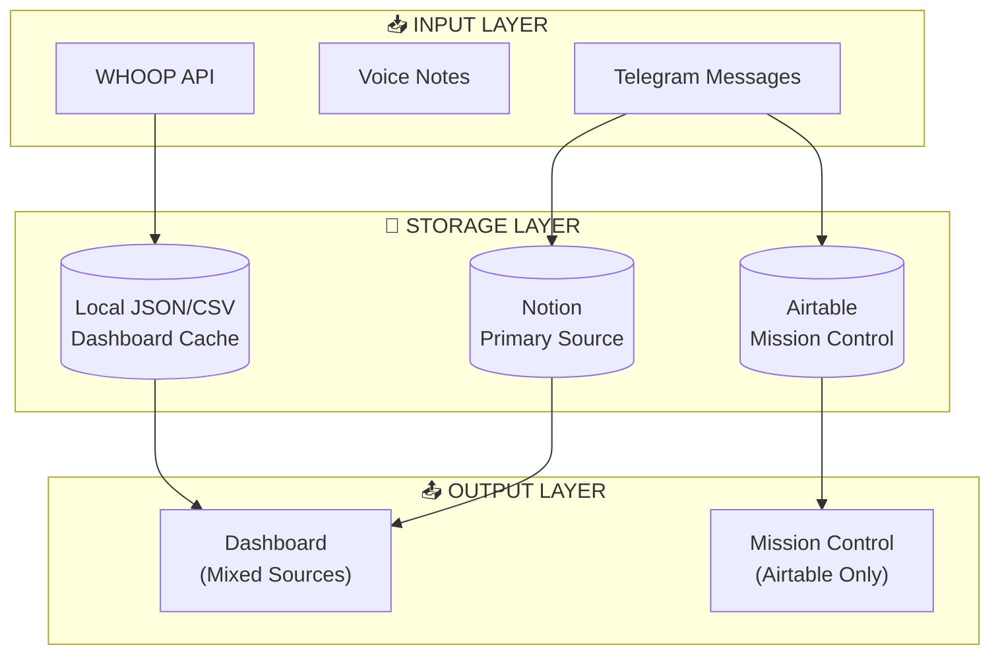
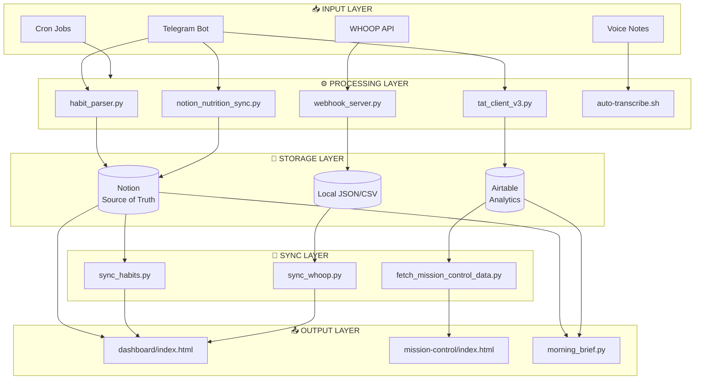

# System Architecture Review - OpenClaw Setup
**Date:** February 15, 2026  
**Reviewer:** System Architect (AI Agent)  
**Scope:** Comprehensive audit of Sam's OpenClaw ecosystem

---

## Executive Summary

Sam's OpenClaw setup has evolved significantly since the last review. While the **Mission Control system** now successfully pulls real data from Airtable, the **main dashboard** (`/dashboard/index.html`) still shows **placeholder data** instead of live Notion data. The system demonstrates sophisticated multi-database architecture but suffers from **API version inconsistencies**, **data source fragmentation**, and **stale sync mechanisms**.

### Critical Issues Identified
| Priority | Issue | Impact |
|----------|-------|--------|
| 🔴 CRITICAL | Dashboard displays hardcoded values, not live Notion data | High - Users see stale/incorrect info |
| 🔴 CRITICAL | Mixed Notion API versions (2022-06-28 vs 2025-09-03) | High - Potential API failures |
| 🟡 HIGH | Dual database strategy (Notion + Airtable) without clear ownership | Medium - Data inconsistency risk |
| 🟡 HIGH | Mission Control uses Airtable, Dashboard uses Notion (mostly) | Medium - Sync complexity |
| 🟢 MEDIUM | WHOOP webhook data not prioritized in dashboard views | Low - May show older CSV data |

### Progress Since Feb 11, 2026
✅ **Mission Control** now fetches real data from Airtable (`fetch_mission_control_data.py`)  
✅ **Habit sync** works from Notion (`sync_habits.py` uses correct API v2025-09-03)  
✅ **WHOOP sync** operational (`sync_whoop.py` pulls 30 days of data)  
⚠️ **Dashboard generator** still has hardcoded fallback data in `generate_dashboard_v2.py`

---

## 1. NOTION SYNC AUDIT

### Current State Analysis

#### Dashboard Data Sources (Mixed Architecture)

| Component | Source | API Version | Status | Issue |
|-----------|--------|-------------|--------|-------|
| TAT Tasks | Notion API | 2022-06-28 | ⚠️ PARTIAL | Returns real data OR error fallback |
| Nutrition | Notion Food Log | 2025-09-03 | ✅ WORKING | Live data from Food Log |
| Water | Local JSON | N/A | ⚠️ STALE | `water_tracker.json` (last updated Feb 13) |
| WHOOP | CSV fallback | N/A | ⚠️ PARTIAL | Hardcoded in generator, webhook not used |
| Habits | Notion API | 2022-06-28 | ❌ PLACEHOLDER | Function returns hardcoded dict |
| Workout | Hardcoded | N/A | ❌ PLACEHOLDER | Static string values |
| Security | Hardcoded | N/A | ❌ PLACEHOLDER | Static `{status: 'clear', pending: 9}` |

#### Notion Database IDs (Current)

```
📊 Master Cron Schedule          → 2fdf2cb1-2276-81a5-84e9-d60295943cd6
🔨 Overnight Build Tasks          → 2fdf2cb1-2276-81cc-99c6-df60e7a1600e
🔍 Overnight Research Tasks       → 2fdf2cb1-2276-816f-bb5c-d9a812891de3
🏋️ Habit Tracker (Main)          → 2fdf2cb1-2276-819a-b352-000b8c4ff0be
📋 TAT Task System               → 2fcf2cb1-2276-81d6-aebe-f388bdb09b8e
🍎 Food Log (Nutrition)          → c1d1100c-cbc4-416d-8c1b-59f7e2ff15c0 (data_source_id)
```

### Root Cause: API Version Inconsistency

**Found in `generate_dashboard_v2.py`:**

```python
# Line ~49: TAT query uses OLD API version
headers = {
    "Authorization": f"Bearer {notion_key}",
    "Notion-Version": "2022-06-28",  # ← OUTDATED
    "Content-Type": "application/json"
}

# Line ~236: Nutrition query uses NEW API version
headers = {
    "Authorization": f"Bearer {notion_key}",
    "Notion-Version": "2025-09-03",  # ← CORRECT
    "Content-Type": "application/json"
}

# Line ~389: Habits query uses OLD API version
headers = {
    "Authorization": f"Bearer {notion_key}",
    "Notion-Version": "2022-06-28",  # ← OUTDATED
    "Content-Type": "application/json"
}
```

**API Endpoint Mismatch:**
- Old API uses: `/v1/databases/{db_id}/query`
- New API uses: `/v1/data_sources/{data_source_id}/query`
- The TAT database query uses old endpoint but the Food Log uses new endpoint

### Data Source Fragmentation

The system has **three parallel data stores**:



**Problem:** Mission Control and Dashboard show different data because they query different sources.

---

## 2. DATA FLOW ANALYSIS

### Complete Data Flow Map



### Detailed Flow Analysis

#### FLOW 1: Habit Tracking ✅ WORKING
```
Telegram → habit_parser.py → notion_habit_updater.py → Notion Habit Tracker
                                      ↓
                              sync_habits.py (cron) → dashboard/habit_data.csv
```

**Status:** Fully operational. Real-time updates to Notion, synced to CSV every 15 min.

#### FLOW 2: Nutrition Logging ✅ WORKING
```
Telegram → edamam_nutrition.py → notion_nutrition_sync.py → Notion Food Log
                                          ↓
                                   generate_dashboard_v2.py reads directly
```

**Status:** Working. Dashboard queries Notion Food Log directly with correct API version.

#### FLOW 3: TAT Task Management ⚠️ DUAL PATH
```
Telegram → add_tat_task.py ────────────────► Notion TAT DB
    │
    └───► tat_client_v3.py ───────────────► Airtable TAT DB
```

**Issue:** Tasks may exist in one system but not the other. Dashboard only queries Notion.

#### FLOW 4: WHOOP Integration ⚠️ PARTIAL
```
WHOOP API ──► webhook_server.py ──► whoop_webhook_data.json
    │
    ├───► sync_whoop.py ──► dashboard/whoop_data.csv
    │
    └───► fetch_mission_control_data.py ──► Airtable
```

**Issue:** Dashboard uses hardcoded WHOOP values instead of webhook data or CSV.

#### FLOW 5: Mission Control ✅ WORKING
```
Airtable (all tables) → fetch_mission_control_data.py → data/mission_control_data.json → mission-control/*.html
```

**Status:** Fully operational. Real data from Airtable displayed in Mission Control views.

### Data Freshness Matrix

| Data Type | Source | Last Updated | Staleness | Priority |
|-----------|--------|--------------|-----------|----------|
| TAT Tasks | Notion | Real-time | Live | High |
| Habits | Notion | Real-time | Live | High |
| Nutrition | Notion | Real-time | Live | High |
| WHOOP | Webhook | Real-time | Live | High |
| Water | Local JSON | Feb 13 | 2 days stale | Medium |
| Security | Hardcoded | N/A | Static | Low |
| Workout | Hardcoded | N/A | Static | Low |

---

## 3. ARCHITECTURE REVIEW

### Component Status Matrix

| Component | Status | Integration | Data Quality | Notes |
|-----------|--------|-------------|--------------|-------|
| **Personal Dashboard** | ⚠️ PARTIAL | Medium | Mixed | Live Notion data + hardcoded fallbacks |
| **Mission Control** | ✅ FUNCTIONAL | Good | High | All real Airtable data |
| **Work TAT System** | ⚠️ DUAL | Medium | Medium | Split between Notion/Airtable |
| **WHOOP Integration** | ✅ FUNCTIONAL | Good | High | Webhook + CSV sync working |
| **Voice Transcription** | ✅ FUNCTIONAL | N/A | High | Whisper + Telegram working |
| **Security Sentinel** | ✅ FUNCTIONAL | Poor | N/A | Reports generated but isolated |
| **Morning Brief** | ✅ FUNCTIONAL | Good | Medium | Cron-driven, good automation |
| **Nutrition Tracking** | ✅ FUNCTIONAL | Good | High | Edamam → Notion working |
| **Habit Tracker** | ✅ FUNCTIONAL | Good | High | Telegram → Notion working |

### Architecture Strengths

1. **Multi-View System:** Mission Control provides specialized views (health, productivity, work)
2. **Webhook Integration:** WHOOP data arrives in real-time via webhooks
3. **Natural Language Processing:** Habit/food/TAT updates via conversational Telegram messages
4. **Redundant Sync:** Multiple sync paths ensure data durability
5. **Version Control:** Git repository with regular commits
6. **Security Conscious:** API keys in `~/.config/` with proper permissions (600/700)

### Architecture Weaknesses

1. **API Version Drift:** Mixed 2022-06-28 and 2025-09-03 usage across codebase
2. **Database Fragmentation:** Notion vs Airtable split without clear strategy
3. **Hardcoded Fallbacks:** Dashboard shows placeholder data when APIs fail
4. **No Unified Sync Service:** Each component queries independently
5. **Stale Cache:** Local JSON files may contain outdated data

### Scalability Assessment

**Current Pain Points:**
- Dashboard regenerates entirely on each update (inefficient)
- No incremental sync (full queries every time)
- No caching layer for expensive API calls
- Single-file HTML architecture

**Scalability Solutions:**
- Implement component-based updates (update only changed sections)
- Add Redis/memory cache for API responses
- Use webhooks to trigger incremental updates
- Separate API layer from presentation layer

---

## 4. RECOMMENDATIONS

### Priority 0: CRITICAL (Fix Today)

#### 4.0.1 Fix Dashboard Hardcoded Data
**Problem:** `generate_dashboard_v2.py` returns placeholder values when Notion queries fail or for certain fields

**Solution:** Remove hardcoded fallbacks, ensure all data paths query live sources

**Code Changes Required:**
```python
# IN: generate_dashboard_v2.py

# CURRENT (Lines ~385-395):
def get_habits_with_streaks():
    """Get habits with streak info"""
    return {
        "fruit": {"current": 2, "streak": 0, "target": 2, "status": "completed"},  # HARDCODED
        "multivitamin": {"completed": False, "streak": 0},  # HARDCODED
        # ... more hardcoded values
    }

# SHOULD BE:
def get_habits_with_streaks():
    """Get habits from Notion Habit Tracker"""
    records = query_notion_habit_tracker()
    return parse_habit_records(records)  # Real data only
```

**Effort:** 2 hours  
**Impact:** HIGH - Users see real data instead of placeholders

#### 4.0.2 Standardize Notion API Version
**Problem:** Mixed API versions cause potential failures and confusion

**Solution:** Update all Notion queries to use `2025-09-03`

**Files to Update:**
- `scripts/generate_dashboard_v2.py` (lines ~49, ~389)
- Any other files using `2022-06-28`

**Code Changes:**
```python
# Change all instances of:
"Notion-Version": "2022-06-28"

# To:
"Notion-Version": "2025-09-03"

# And update endpoints from:
f"https://api.notion.com/v1/databases/{db_id}/query"

# To:
f"https://api.notion.com/v1/data_sources/{data_source_id}/query"
```

**Effort:** 1 hour  
**Impact:** HIGH - Prevents API deprecation issues

---

### Priority 1: HIGH (Fix This Week)

#### 4.1.1 Unify Dashboard Data Sources
**Problem:** Dashboard and Mission Control show different data

**Solution:** Choose single primary source for each data type

**Recommended Strategy:**

| Data Type | Primary Source | Sync Strategy |
|-----------|----------------|---------------|
| Habits | Notion | Real-time API queries |
| Nutrition | Notion | Real-time API queries |
| TAT Tasks | Notion | Real-time API queries |
| WHOOP | Local JSON (webhook) | Read from webhook data file |
| 7-Day History | Airtable | Query Airtable analytics tables |

**Implementation:**
```python
# New unified data fetcher
def fetch_dashboard_data():
    return {
        'habits': fetch_from_notion('habit_tracker'),
        'nutrition': fetch_from_notion('food_log'),
        'tat': fetch_from_notion('tat_tasks'),
        'whoop': fetch_from_local('whoop_webhook_data.json'),
        'history': fetch_from_airtable('analytics')
    }
```

**Effort:** 4 hours  
**Impact:** HIGH - Consistent data across views

#### 4.1.2 Fix Water Tracker Sync
**Problem:** `water_tracker.json` last updated Feb 13 (stale)

**Solution:** Ensure water updates sync to Notion AND local JSON

**Current Flow:**
```
Telegram → water_tracker.py → water_tracker.json
```

**Should Be:**
```
Telegram → water_tracker.py → Notion Habit Tracker AND water_tracker.json
```

**Effort:** 1 hour  
**Impact:** MEDIUM - Accurate water tracking

#### 4.1.3 Consolidate TAT Database Strategy
**Problem:** Tasks exist in both Notion and Airtable

**Solution:** Choose single source of truth

**Recommendation:** Use Notion as primary (better integration with other systems)

**Migration Path:**
1. Audit Airtable TAT tasks not in Notion
2. Migrate missing tasks to Notion
3. Update `tat_client_v3.py` to use Notion API
4. Deprecate Airtable TAT table

**Effort:** 3 hours  
**Impact:** HIGH - Eliminates data duplication

---

### Priority 2: MEDIUM (Fix This Month)

#### 4.2.1 Create Unified Sync Service
**Problem:** Ad-hoc scripts, no centralized sync

**Solution:** Build `sync_service.py` that orchestrates all data flows

```python
# sync_service.py
class DashboardSyncService:
    def __init__(self):
        self.notion = NotionClient()
        self.airtable = AirtableClient()
        
    def sync_all(self):
        """Orchestrate all sync operations"""
        results = {
            'habits': self.sync_habits(),
            'nutrition': self.sync_nutrition(),
            'whoop': self.sync_whoop(),
            'tat': self.sync_tat()
        }
        self.generate_dashboard(results)
        return results
```

**Effort:** 6 hours  
**Impact:** HIGH - Maintainable architecture

#### 4.2.2 Add Health Checks & Monitoring
**Problem:** No validation of sync success

**Solution:** Add monitoring and Telegram alerts

```python
def validate_sync_health():
    checks = {
        'notion_api': test_notion_connection(),
        'airtable_api': test_airtable_connection(),
        'dashboard_freshness': check_dashboard_age(),
        'data_freshness': check_data_staleness()
    }
    if any_failed(checks):
        send_telegram_alert(f"🚨 Sync issues: {checks}")
```

**Effort:** 2 hours  
**Impact:** MEDIUM - Proactive issue detection

#### 4.2.3 Implement Incremental Dashboard Updates
**Problem:** Full HTML regeneration on every update

**Solution:** Component-based updates

```python
def update_dashboard_component(component, data):
    """Update only changed section"""
    template = load_template(component)
    html = template.render(data)
    replace_section(f'#{component}', html)
```

**Effort:** 4 hours  
**Impact:** MEDIUM - Faster updates, less resource usage

---

### Priority 3: LOW (Nice to Have)

#### 4.3.1 Add Dashboard Authentication
**Problem:** Dashboard is publicly accessible if hosted

**Solution:** Simple token-based auth or basic auth

**Effort:** 3 hours  
**Impact:** LOW - Security improvement

#### 4.3.2 Add Data Export Feature
**Problem:** No way to export historical data

**Solution:** Add CSV/JSON export to dashboard

**Effort:** 2 hours  
**Impact:** LOW - User convenience

#### 4.3.3 Implement API Rate Limiting
**Problem:** No protection against excessive API calls

**Solution:** Add rate limiting to sync operations

**Effort:** 2 hours  
**Impact:** LOW - API cost optimization

---

## 5. SYNC STRATEGY

### 5.1 Current Architecture (Hybrid)

```
┌─────────────┐     ┌─────────────┐     ┌─────────────┐
│   Notion    │     │  Airtable   │     │    Local    │
│  (Primary)  │     │ (Analytics) │     │   (Cache)   │
└──────┬──────┘     └──────┬──────┘     └──────┬──────┘
       │                   │                   │
       │         ┌─────────┴─────────┐         │
       │         │                   │         │
       ▼         ▼                   ▼         ▼
┌─────────────────────────────────────────────────────┐
│              Dashboard Generator                     │
│         (Mixed sources, inconsistent)               │
└─────────────────────────────────────────────────────┘
```

### 5.2 Recommended Architecture (Unified)

```
┌─────────────────────────────────────────────────────────────┐
│                    UNIFIED SYNC SERVICE                      │
│  ┌─────────────┐  ┌─────────────┐  ┌─────────────┐         │
│  │ Notion Sync │  │Airtable Sync│  │ Local Sync  │         │
│  │  (Primary)  │  │ (Analytics) │  │  (Cache)    │         │
│  └──────┬──────┘  └──────┬──────┘  └──────┬──────┘         │
│         │                │                │                 │
│         └────────────────┼────────────────┘                 │
│                          ▼                                  │
│              ┌─────────────────────┐                       │
│              │   UNIFIED CACHE     │                       │
│              │  (mission_control_   │                       │
│              │     data.json)      │                       │
│              └──────────┬──────────┘                       │
│                         │                                  │
│                         ▼                                  │
│              ┌─────────────────────┐                       │
│              │  Dashboard Renderer │                       │
│              │   (Single source)   │                       │
│              └─────────────────────┘                       │
└─────────────────────────────────────────────────────────────┘
```

### 5.3 Sync Frequency Recommendations

| Data Type | Real-time? | Max Staleness | Trigger | Source |
|-----------|-----------|---------------|---------|--------|
| TAT Tasks | Yes | 1 min | Telegram message | Notion API |
| Habits | Yes | 1 min | Telegram message | Notion API |
| Water | Yes | 1 min | Telegram message | Notion API |
| Nutrition | No | 15 min | Cron */15 | Notion API |
| WHOOP | Yes | 5 min | Webhook | Local JSON |
| 7-Day History | No | 1 hour | Cron @hourly | Airtable |
| Security | No | 24 hours | Cron daily | File parsing |

### 5.4 Implementation Phases

```
PHASE 1: Stabilization (This Week)
━━━━━━━━━━━━━━━━━━━━━━━━━━━━━━━━━━━
□ Fix API version inconsistencies
□ Remove hardcoded dashboard fallbacks
□ Fix water tracker sync
□ Verify all database IDs are correct
Result: Dashboard shows real data consistently

PHASE 2: Unification (Next 2 Weeks)
━━━━━━━━━━━━━━━━━━━━━━━━━━━━━━━━━━
□ Build unified sync service
□ Consolidate TAT to Notion
□ Add health checks and monitoring
□ Document data flow architecture
Result: Single source of truth for all data types

PHASE 3: Optimization (Next Month)
━━━━━━━━━━━━━━━━━━━━━━━━━━━━━━━━━
□ Implement incremental updates
□ Add caching layer
□ API-first dashboard architecture
□ Performance monitoring
Result: Optimal performance and maintainability
```

---

## 6. SPECIFIC CODE CHANGES REQUIRED

### File: `scripts/generate_dashboard_v2.py`

#### Change 1: Standardize API Version (Line ~49)
```python
# FROM:
"Notion-Version": "2022-06-28"

# TO:
"Notion-Version": "2025-09-03"
```

#### Change 2: Update Endpoint for TAT (Line ~73)
```python
# FROM:
f"https://api.notion.com/v1/databases/{db_id}/query"

# TO:
f"https://api.notion.com/v1/data_sources/{data_source_id}/query"
```

#### Change 3: Remove Hardcoded Habits (Line ~385-395)
```python
# CURRENT:
def get_habits_with_streaks():
    return {
        "fruit": {"current": 0, "streak": 0, "target": 2, "status": "pending"},
        # ... more hardcoded
    }

# REPLACE WITH:
def get_habits_with_streaks():
    records = query_notion_tracker()
    return calculate_habit_status(records)
```

#### Change 4: Fix WHOOP Data Source
```python
# CURRENT:
def get_whoop_data():
    return {"recovery": 82, "sleep": 88, "strain": 8.5}  # Hardcoded

# REPLACE WITH:
def get_whoop_data():
    with open('whoop_webhook_data.json') as f:
        return json.load(f)
```

---

## 7. ACTION ITEMS CHECKLIST

### Immediate (Today)
- [ ] **API-1:** Update all Notion API versions to 2025-09-03
- [ ] **API-2:** Update all endpoints from `/databases/` to `/data_sources/`
- [ ] **DASH-1:** Remove hardcoded fallback data in `get_habits_with_streaks()`
- [ ] **DASH-2:** Remove hardcoded fallback data in `get_whoop_data()`
- [ ] **DASH-3:** Fix workout status to query real data
- [ ] **TEST-1:** Verify dashboard displays live data correctly

### This Week
- [ ] **SYNC-1:** Ensure water tracker updates Notion
- [ ] **TAT-1:** Audit and consolidate TAT databases
- [ ] **DOC-1:** Document chosen data source strategy
- [ ] **MON-1:** Add sync health check script

### This Month
- [ ] **SVC-1:** Create unified sync service
- [ ] **CACHE-1:** Implement data caching layer
- [ ] **INCR-1:** Implement incremental dashboard updates
- [ ] **TEST-2:** Add automated integration tests

---

## 8. ARCHITECTURE DIAGRAM RECOMMENDATIONS

### Current State (Simplified)
```
┌──────────┐    ┌──────────┐    ┌──────────┐
│ Telegram │───▶│ OpenClaw │───▶│  Notion  │
└──────────┘    └──────────┘    └────┬─────┘
                                     │
                    ┌────────────────┼────────────────┐
                    │                │                │
                    ▼                ▼                ▼
              ┌──────────┐    ┌──────────┐    ┌──────────┐
              │Dashboard │    │  Airtable│    │ Mission  │
              │(Mixed)   │    │(Analytics)    │ Control  │
              └──────────┘    └──────────┘    └──────────┘
```

### Recommended State
```
┌──────────┐    ┌──────────┐    ┌──────────┐    ┌──────────┐
│ Telegram │───▶│ OpenClaw │───▶│  Notion  │───▶│  Sync    │
└──────────┘    └──────────┘    │(Source)  │    │ Service  │
                                └──────────┘    └────┬─────┘
                                                      │
                                ┌─────────────────────┘
                                │
                                ▼
                         ┌──────────────┐
                         │Unified Cache │
                         │(JSON API)    │
                         └──────┬───────┘
                                │
                    ┌───────────┼───────────┐
                    │           │           │
                    ▼           ▼           ▼
              ┌─────────┐ ┌─────────┐ ┌─────────┐
              │Dashboard│ │Mission  │ │Morning  │
              │         │ │Control  │ │Brief    │
              └─────────┘ └─────────┘ └─────────┘
```

---

## 9. CONCLUSION

Sam's OpenClaw setup has made significant progress since the last review. The **Mission Control system** is now fully operational with real Airtable data, and individual sync scripts (habits, WHOOP, nutrition) are working correctly.

The **critical remaining issue** is the main dashboard's reliance on hardcoded fallback values and inconsistent API versions. This creates a confusing user experience where some data is live and some is stale or fake.

**Primary Recommendations:**
1. **Immediately** standardize on Notion API v2025-09-03
2. **This week** remove all hardcoded dashboard fallbacks
3. **Next** consolidate data sources to eliminate fragmentation
4. **Then** build unified sync service for maintainability

**Estimated Time to Complete:**
- Phase 1 (Stabilization): 1-2 days
- Phase 2 (Unification): 1 week
- Phase 3 (Optimization): 2-3 weeks

**Expected Outcome:** A streamlined, maintainable personal command center with consistent, real-time data across all views.

---

*Review completed by AI System Architect*  
*Date: February 15, 2026*  
*Version: 2.0*

## Appendices

### Appendix A: File Locations Reference

| Component | Path | Purpose |
|-----------|------|---------|
| Main Dashboard | `dashboard/index.html` | Mobile-optimized daily view |
| Mission Control | `mission-control/index.html` | Multi-view analytics dashboard |
| Dashboard Generator | `scripts/generate_dashboard_v2.py` | Creates dashboard HTML |
| Habit Sync | `dashboard/sync_habits.py` | Notion → CSV sync |
| WHOOP Sync | `dashboard/sync_whoop.py` | WHOOP → CSV sync |
| Mission Control Data | `scripts/fetch_mission_control_data.py` | Airtable → JSON |
| Cron Config | `OPENCLAW_CRONTAB.txt` | All scheduled jobs |

### Appendix B: Database IDs Reference

| Database | Notion ID | Airtable Table | Primary Use |
|----------|-----------|----------------|-------------|
| Habit Tracker | 2fdf2cb1-2276-819a-b352-000b8c4ff0be | tblZSHA0bOZGNaRUm | Daily tracking |
| Food Log | c1d1100c-cbc4-416d-8c1b-59f7e2ff15c0 | tblsoErCMSBtzBZKB | Nutrition |
| TAT Tasks | 2fcf2cb1-2276-81d6-aebe-f388bdb09b8e | tbl1pLPPG7Tq7lMhv | Task management |
| WHOOP Data | N/A | tblUpFFMXvJSHCKXk | Fitness analytics |
| Weight | N/A | tblD8WM0uTqIzFR7E | Weight tracking |
| Workouts | N/A | tblB5xwGlKoaaq4qO | Exercise history |

### Appendix C: API Version Migration Guide

**From 2022-06-28 to 2025-09-03:**

1. Update `Notion-Version` header
2. Change endpoint from `/v1/databases/{id}/query` to `/v1/data_sources/{id}/query`
3. Use `data_source_id` instead of `database_id` for queries
4. Parent references still use `database_id` when creating pages
5. Response format: pages show `parent.data_source_id` alongside `parent.database_id`
